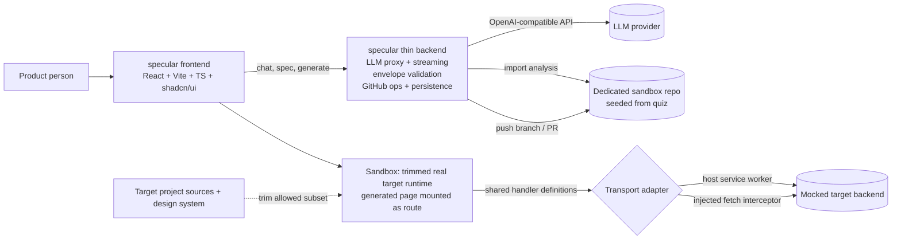

# specular

| Field | Value |
|---|---|
| Project | specular |
| Status | Draft v0.6 (for review) |
| Date | 2026-09-12 |
| Author | specular discovery (co-defined with the founder) |
| Reviewers | Founder |
| Scope | Frontend-focused POC, single user, no auth |

## TL;DR

specular is a workspace where product people design features by talking to an AI, watch those features render as live, dev-ready mocked UI built from the real project's code and design system, then hand off by pushing the feature plus its full spec context into a dedicated sandbox repo. The developer who picks it up implements the backend and replaces the mocked interface. The no-frontend-rework claim is limited to that: the developer implements the backend and replaces the mocked interface, while pixel-level design-system fidelity is approximated. The POC proves this end to end on two paths: a mature GitHub repo (Colorkrew/quiz) and a from-scratch scaffold, both in one demo.

## Build sequence: mocked first, real later

One rule applies to every part of specular: the first phase is mocked, the second is real (D-14).

- **Phase 1 (UI MVP, all mocked).** Nothing in specular is real yet. The AI conversation and structured spec authoring are served from replay-style streaming fixtures: the chat plays scripted responses, with no interactive LLM session and no real LLM calls. Generation returns fixed validated envelopes (no real model output), the handoff push is simulated, and no server process runs. We iterate on how the workspace looks and behaves, against the same contract the backend will later implement.
- **Phase 2 (backend integration, everything real).** Once the UI is settled, the thin backend is implemented behind that contract: a real LLM provider (server-side keys, streaming), real generation and envelope validation, real GitHub operations, and real persistence. The UI and its imports do not change; only the mocked internals are replaced.

Acceptance tests and the demo run offline on both replay axes (Section 9.3).

## 1. Vision & Problem

Today a feature is born in a conversation, written into a doc, lost in translation to a ticket, rebuilt by hand from a mockup, and finally reconciled by a developer guessing what product meant. The specification drifts from the code the moment implementation starts, and nobody can tell which parts of the doc still correspond to reality.

specular closes that loop by keeping one thread running from intent to code. Product people describe what they want, the AI turns it into a living specification and a running mocked UI that already uses the target project's real components and tokens, and the handoff is that artifact, not a document about it. The developer receives working frontend code plus the reasoning behind it, and only implements the backend behind a mocked interface.

Three pain points drive this:
- Specs go stale the moment they are written.
- Handoff from product to development is lossy.
- Feature design is detached from delivery and from the real product.

The thesis: reinvent how products get implemented, so that the thing handed to engineering is the feature itself, verified against the project's own design system, with its context attached.

## 2. Goals & Non-Goals

Goals:
- Prove the full loop: conversation to spec, spec to live mocked UI, UI to repository handoff.
- Keep the spec and the generated UI in sync as the conversation continues, showing diffs.
- Constrain generated UI to the target project's existing components and tokens.
- Show both setup paths (import a mature repo, start from scratch) in one demo.

Non-goals (explicit):
- Lifecycle-stage visibility. Deferred post-MVP.
- Roles, permissions, authentication, multi-user. Out of scope for the POC.
- Direct design-system editing by designers (Figma-like DS authoring that transposes into components). Future phase.
- Analytics and reporting.
- Real backends for designed products. The target product's backend stays mocked.

## 3. Users

No personas and no roles. Any product person (PDM, PO, designer) uses one uniform workflow. The POC is a single-user demo with no login.

## 4. Core Workspace

A project opens as a single screen, not a step wizard. The chat panel is always available on the left; the main area shows the mocked UI with a top switcher between UI and Specification. Handoff is a top-bar action. The agent works continuously on this screen: every accepted message updates the structured spec and refreshes the mocked UI.

### 4.1 The screen

| Aspect | Detail |
|---|---|
| Chat panel | Left side, always available. The single conversation for the project; also the only way to change the spec or the UI |
| Main area | The current state of the application with the feature applied, rendered live in the sandbox. Default view |
| Switcher | At the top: UI or Specification |
| Specification view | The structured spec browsed as a wiki (sections as pages), like a docs tool |
| Handoff | Top-bar action. Opens the handoff panel: what will be pushed, the branch/PR result on success, error and retry on failure |
| Definition of done | A project opens directly into this screen; chat, UI, and spec are reachable without any step progression |

### 4.2 Conversation and the structured spec

| Aspect | Detail |
|---|---|
| User actions | Describes the feature in chat; refines it over turns; references a spec section when asking for a change |
| AI behavior | Real LLM interaction (Phase 2; Phase 1 serves the conversation from replay fixtures). Drafts and refines the structured spec: problem, goals, user stories, acceptance criteria. Asks targeted clarifying questions when the description is vague, then updates the spec. Structured authoring and wiki-style spec browsing are the priority; technical/API contracts are deferred to the mocked API layer |
| Spec authorship | AI-authored only. The human never edits spec text directly; changes happen by talking to the agent |
| Outputs | A persisted, versioned spec. Every accepted turn records a SpecVersion, paired with a GeneratedUIVersion (Section 5) |
| Change review | Spec changes are reviewable GitHub-PR-style, adapted: side-by-side "before vs after" per section while browsing; full version history is retained |
| UI surface | Chat panel; Specification view under the top switcher |
| Definition of done | Spec contains problem, goals, user stories, and acceptance criteria; it is saved, re-openable, and browsable as a wiki; subsequent messages update it and the change is reviewable side-by-side |

### 4.3 Mocked UI

| Aspect | Detail |
|---|---|
| User actions | Asks for changes in chat; switches to the UI view; interacts with the mock |
| AI behavior | Writes React (TSX) that passes the Generation Contract (Section 5) and renders live in the sandbox. Every accepted turn refreshes the mock |
| Outputs | A live rendered UI plus a paired spec and generated-UI version; the mock always shows the current state and stays in sync with the spec |
| UI surface | Main area, UI view |
| Definition of done | Generated UI renders in the sandbox against the mocked backend; a follow-up message produces a visible change to the mock |

### 4.4 Handoff

| Aspect | Detail |
|---|---|
| User actions | Clicks the top-bar Handoff action and confirms |
| AI behavior | Shows what will be pushed, then pushes the generated feature code and the full spec context into the dedicated sandbox repo on a branch/PR (never main), so the implementing AI has the feature merged with full context |
| Outputs | A branch/PR containing feature code plus spec context; a handoff summary; errors surfaced with retry |
| UI surface | Handoff panel opened from the top bar |
| Definition of done | The branch/PR exists in the sandbox repo and contains the generated code and spec context; the developer story is "implement the backend and replace the mocked interface" |

## 5. Generation Contract

Every generation turn returns one validated envelope. The server owns the schema; the frontend never renders unvalidated model output.

Envelope fields:
- `spec_document`: the structured spec (problem, goals, user stories, acceptance criteria).
- `code_files`: generated files with paths and contents.
- `change_summary`: human-readable description of what changed, used for the diff.

Rules:
- The server validates the envelope against the schema. An invalid envelope is a generation failure (AC-4).
- Chat message tokens may stream. Generated code is buffered, validated, and statically analyzed before it reaches the sandbox. Partial TSX is never streamed into the sandbox.
- Each turn creates a `SpecVersion` and a `GeneratedUIVersion` together. Both are immutable and paired. There are no unpaired or mutable versions.

Allowed imports:
- Kit components (allowed subset, 10): `KitButton`, `KitIconButton`, `KitCard`, `KitModal`, `KitChip`, `KitStatus`, `KitTable`, `KitTextField`, `KitTextArea`, `KitSelect`.
- Explicitly excluded for the POC: `KitDataGrid`, `KitDatePicker`, `KitFileUpload`, `KitBottomNav`. They exist in the kit but stay out of the allowlist until a spike extends it.
- API: curated endpoints only (the boot set plus the feature endpoints for the active demo, roughly three in total).
- Styling: theme tokens only, read through `useTheme()`. No literal colors or spacing.

Static analysis rules (these implement enforcement; AC-11 checks them, not the LLM's own claims):
- Forbidden imports: anything outside the allowlist (raw `@mui/material` beyond Kit wrappers, `@mui/x-data-grid`, `@mui/x-date-pickers`, `styled`, emotion `css`, icons outside the allowlist).
- Raw MUI usage: JSX tags from `@mui/material` that are not wrapped by a Kit component.
- Hex and px literals: colors and spacing must come from theme tokens.
- Hardcoded user-facing strings: user-visible text must go through `t()`.
- Violations are reported per file with line references and prevent the version from being marked valid.

i18n rule:
- Generated code emits `t()` keys and the envelope carries locale entries. Per D-13, handoff writes those entries into all four locale files (en/ja/ko/pt_BR).

## 6. Project Setup & Repo Import

One demo shows both entry paths.

From scratch:
- Scaffolds a minimal repo (frontend + mocked backend) as the new project's "mocked version".
- The generated UI targets that scaffold and its minimal design system.

Import from GitHub:
- Import runs a mocked analysis and creates the "mocked version of the repository": the frontend plus a mocked backend, ready for live UI.
- The mature demo target is Colorkrew/quiz, a local checkout whose import analysis is mocked but based on the real repository.
- Import is the seam where design-system detection (Section 7) and mock generation (Section 9) run.

## 7. Design System & Harness

A harness is a component kit plus the rules for using it. Different projects carry different design systems, and specular follows the existing one rather than imposing its own.

- Generation context: the harness is the generation agent's working context on every turn: the allowed Kit inventory (with real exemplars), theme tokens, the usage rules (kit-first, sx-only, tokens-only, t() for user-facing strings), and the API seam.
- New vs existing projects: for a project started from scratch, the harness is specular's own minimal design system and is fully known. For an imported project, the harness is detected from the real repo and stays approximate by nature; a project built without a harness beforehand cannot be fully generalized into one.
- Detection: extract tokens and build a component inventory from the target project.
- Enforcement: generated code is constrained to the allowlist and tokens; violations are flagged by static analysis (Section 5).
- POC interaction model for designers is chat-only.
- Generated UI inherits the target project's design system, never specular's own UI kit.
- Revisitable design-system management and audit is desirable but beyond the POC.
- Direct designer editing of the design system is a future phase and explicitly deferred.

### 7.1 Quiz harness facts (mature target)

These anchor detection and demonstration; they are not the spec's subject.

- UI stack: MUI 7.3.9 + Emotion, not Tailwind and not shadcn.
- Component kit "UIKit": roughly 34 `Kit*` components under `frontend/src/components/UIKit/` with a barrel `index.ts`, plus Figma Code Connect (`*.figma.tsx`) mappings.
- Tokens: `frontend/src/theme/tokens.ts` (palette, typography, breakpoints) and `frontend/src/theme/mui.theme.ts` (spacing, radius, elevation, `createMuiTheme` factory).
- Styling rule: `sx` prop only. No `styled()` or `css()`. Kit-first. Theme tokens only.
- Light mode only, no dark mode. Four locales (en/ja/ko/pt_BR), default ja.

Honesty note: with the sandbox hosting trimmed real sources (Section 9.1), component behavior is real; pixel-level design-system fidelity is still approximated and stated as such.

## 8. Technical Architecture

specular frontend: React + Vite + TypeScript + shadcn/ui. This is specular's own UI, deliberately distinct from any imported project's design system.

specular backend: real and thin, implemented in Phase 2 (Phase 1 runs with no server). It handles LLM orchestration and proxy (server-side keys, streaming), the Generation Contract validation, GitHub operations (import/analysis and handoff push), and persistence of projects, chats, spec versions, and generated-UI versions. No auth, no multi-user.

LLM: real from Phase 2, via a configurable OpenAI-compatible provider (base URL and key); during Phase 1 the conversation is served from replay fixtures. Model choice is open (Section 16).

UI generation: the LLM writes React (TSX). The backend buffers and validates the envelope, the frontend renders the accepted result live in the sandbox. The target product's backend is mocked. Two deterministic replay axes support tests and demo stability (Section 9.3).

## 9. Sandbox & Mock Strategy

### 9.1 Sandbox: real target sources (D-11)

The sandbox hosts a trimmed copy of the real target project runtime:
- actual `Kit*` component sources from the allowed subset,
- the theme factory and tokens,
- the API client and store,
- i18n,
- a preview shell with the generated page mounted as the route.

This runs the real sources rather than simulating them. Pixel-level design-system fidelity is still bounded by the trimmed runtime and is stated honestly.

Hard gate: Phase 0 spike.
- Before any generation work, prove the sandbox with one hand-written page that uses real `KitButton` and `KitCard`, the theme, and one intercepted API call.
- It must run fully offline, on React 19 + MUI 7 + Emotion, with no hosted bundler service.
- It must be assertable from Playwright inside the frame using `frameLocator`.
- If the spike fails, the founder re-decides with the failure documented (Section 15).

### 9.2 Mock and transport adapter

- One transport adapter: MSW cannot register a service worker inside sandboxed preview frames (srcdoc, blob, or cross-origin). Define one transport adapter with shared handler definitions that work either through the host service worker (same-origin) or through an injected fetch interceptor inside the sandbox (for example `@mswjs/interceptors` `FetchInterceptor`).
- D-6 stands on the handler definitions: MSW-style definitions are the preference. The delivery mechanism is per-spike.
- Required boot endpoints (all three, or the app cannot boot): `GET /api/v1/app/me/detail`, `GET /api/v1/app/workspaces`, `GET /api/v1/app/workspaces/overview`.
- Quiz seam facts: single RTK Query slice with `fetchBaseQuery` in `frontend/src/services/api/internal_v2/client.ts`; `baseUrl: '/api/v1/app'`; `credentials: 'include'`; the `qs` paramsSerializer uses `arrayFormat: 'repeat'`, so handlers read repeated params with `searchParams.getAll`.
- Curated handlers cover the boot set plus the feature endpoints for the active demo. The full OpenAPI (61 paths, 84 operations) is a reference and the source of truth for shapes, not a generation target.
- Uploads stay separate: multipart `FormData` via `multipartFormData.ts`, and `/uploads` is proxied to blob storage rather than served by the mocked API.

The mock contract is an explicit swap seam (Section 10). When the real backend lands, the developer replaces one module without touching the generated UI. Integration theater is a named risk (Section 15); the mock must behave like the contract, not just visually.

### 9.3 Replay and determinism (C)

- Two axes: `SPECULAR_LLM_MODE=replay` and `SPECULAR_GITHUB_MODE=replay`. Target fixtures are always on.
- Failure scenarios use explicit test-only triggers (for example a known request hash or a scenario id header) so replay can invoke AC-2, AC-4, and AC-7 deterministically.
- Freeze the clock and IDs; reset the store per run.
- Determinism scope: artifact IDs plus a DOM snapshot, not byte equality.
- Replay responses are keyed by request hash plus prompt version. Regenerate fixtures whenever prompts change; a stale-fixture check fails the suite.

## 10. Handoff & Dev Integration

What gets pushed:
- Feature code under `frontend/src/features/<domain>/`.
- A spec-context file at `docs/specular/<feature>.md` containing the structured spec and the conversation's settled decisions.
- A fixture and mock module behind exactly one import seam. The target repo has no MSW; the branch must build and run with mocks and add no new runtime deps. Prefer a fixture module plus a single transport seam.

PR body template: the structured spec plus the conversation decisions.

Where: the dedicated sandbox repo (D-12), seeded from quiz and owned for demos. The real product repo is never touched. Branch/PR only, never main.

Token and GitHub client:
- Fine-grained PAT scoped to `contents:write` and `pull_requests:write`, held in a server-side env var only, wrapped behind a `GitHubClient` interface.
- Server-side safety: ref allowlist `^refs/heads/specular/`; branch from the current default head; never main; no force-updates outside the namespace; idempotent retry; a clean failure state.
- Implement via the GitHub REST API (ref, then tree/commit, then PR). Never mutate the local checkout.

Preflight before push:
- Materialize the generated files in a temp worktree of the checkout and run `tsc --noEmit` plus `biome check`.
- Block the push and report the failure if either fails.

What "replace the mocked interface" means:
- The generated feature exposes one module boundary, for example `frontend/src/features/<domain>/data/`, exporting typed functions the UI imports.
- In the POC that module reads fixtures. The developer replaces its internals with real API calls behind the same functions.
- The UI and its imports do not change. That is the swap: one module, one contract.

## 11. Demo Script

One roughly five-minute narrative covering both paths, run on replay mode for stability.

Mature path (import Colorkrew/quiz):
- Import the repo, show the mocked analysis producing the mocked version and detected tokens/components.
- Canonical feature: result sharing for a quiz. Sample data: a completed quiz named "Onboarding Basics" with score 8/10, a shareable result card, and a "Copy link" action.
- Wow moments: the conversation produces a structured spec; the UI appears live in the sandbox using real Kit components and theme tokens; enforcement flags a deliberate violation; the feature is pushed to a branch in the dedicated sandbox repo.

Scaffolded path (from scratch):
- Create a minimal project and show the mocked backend scaffold.
- Canonical feature: a workspace overview card showing member count with an "Invite member" button. Sample data: 2 members, active workspace "Acme".
- Same loop, smaller surface, proving the path is not quiz-specific.

Close on the handoff: the branch/PR in the sandbox repo holds the feature plus context, and the developer's remaining job is the backend.

## 12. Success Criteria

- Internal buy-in: the founder and the team agree the POC demonstrates the thesis and is worth continuing.
- An evaluator can, unaided, complete the full loop on both paths: hold a conversation that yields a structured spec, browse it as a wiki, iterate the live mocked UI, and push a handoff.
- The evaluator can see the spec and the mock stay in sync, and can see the target project's design system respected, with approximation stated rather than hidden.

## 13. Acceptance Criteria (executable)

Harness: run against the POC offline with both replay axes (`SPECULAR_LLM_MODE=replay` and `SPECULAR_GITHUB_MODE=replay`), target fixtures always on, a seeded fixture project, and Playwright driving the browser. Sandbox assertions use `frameLocator`. Failure scenarios are invoked through the test-only triggers (Section 9.3). Every criterion is observable in the DOM, in the store, or via the mocked or replayed API; none require human judgment.

Happy and failure paths per major flow:

- AC-1 Conversation (happy): creating a quiz project and sending one message yields a persisted spec containing a problem, goals, at least one user story, and acceptance criteria.
- AC-2 Conversation (failure): a scenario trigger makes the LLM return an error; a visible error appears with a Retry control, the previous spec is unchanged, and retry recovers.
- AC-3 Generation (happy): an accepted message refreshes the mocked UI in the sandbox and records a paired `SpecVersion` and `GeneratedUIVersion`.
- AC-4 Generation (failure): a scenario trigger returns an invalid envelope or invalid TSX; the sandbox shows an error state and offers retry, and no broken version is recorded as valid.
- AC-5 Iteration sync: a second message changes both the spec and the mock; the spec change is reviewable side-by-side and the mock shows the new state.
- AC-6 Handoff (happy): confirming handoff pushes to the dedicated sandbox repo via `GITHUB_MODE=replay`; the created ref matches `^refs/heads/specular/` and is not main; the pushed tree matches the Section 10 layout.
- AC-7 Handoff (failure): a scenario trigger fails the push; an error state with retry is shown, the UI does not claim a successful push, and no ref outside the namespace is created or updated.
- AC-8 Import path: importing the quiz fixture shows a mocked repo analysis with detected tokens and a component inventory.
- AC-9 Scaffold path: creating a project from scratch provisions the minimal scaffold and its mocked backend, and generation targets it.
- AC-10 Boot stubs: with `GET /api/v1/app/me/detail`, `GET /api/v1/app/workspaces`, and `GET /api/v1/app/workspaces/overview` mocked, the workspace loads and no real authentication occurs.
- AC-11 Design-system enforcement: static analysis of generated code flags a forbidden import, raw MUI usage, a hex or px literal, and a hardcoded user-facing string; the flags come from the analyzer, not LLM self-report, and are triggered deterministically in replay.
- AC-12 Determinism: all criteria in this section pass offline with both replay axes; determinism is scoped to artifact IDs plus a DOM snapshot across runs.
- AC-13 i18n: generated code uses `t()`, and after handoff the locale entries exist in all four locale files (en/ja/ko/pt_BR).
- AC-14 Preflight: generated files pass `tsc --noEmit` and `biome check`; the branch builds with mocks; a swap test that replaces one handler module keeps the UI building.

## 14. Scope Boundaries

In:
- One uniform workflow, single user, no auth.
- Two setup paths and one demo covering both.
- Real LLM conversation, real generated TSX, live sandbox on trimmed real target sources.
- Design-system detection and static-analysis enforcement.
- Real GitHub push to the dedicated sandbox repo (branch/PR only).
- Mocked target backend via shared handler definitions plus one transport adapter.

Out:
- Auth, roles, permissions, multi-user.
- Realtime collaboration.
- Analytics.
- Lifecycle-stage visibility.
- Designer-facing design-system editing.
- Real backends for designed products.
- Full pixel-level design-system fidelity guarantees for generated code.

Hard caps:
- Few core entities, flow-first model. The model is Project, Chat and messages, SpecVersion, and GeneratedUIVersion. Handoff is an operation, not an entity.
- SpecVersion and GeneratedUIVersion are immutable and paired. No version exists without its pair.
- Frontend-focused: depth goes into the conversation-to-UI loop, not into backend breadth.

## 15. Risks & Mitigations

| Risk | Mitigation |
|---|---|
| LLM nondeterminism | Two replay axes for tests and demo; stream status and errors visibly; replay fixtures keyed by request hash plus prompt version |
| Sandbox cannot host the target runtime | Hard spike gate (Phase 0); if it fails, a documented re-decision rather than a silent fallback |
| Sandbox fidelity for MUI-based design systems | Trimmed real sources close the gap; pixel-level fidelity still approximated and stated honestly; enforcement by static analysis |
| Generated code fails typecheck/lint in the target repo | Preflight in a temp worktree runs `tsc --noEmit` and `biome check`; the push is blocked and reported on failure |
| LLM code quality and consistency | Generation scoped to the allowlist; envelope validation; diffs and version history; errors surfaced with retry |
| Stale replay fixtures after prompt changes | Fixtures keyed by request hash plus prompt version; stale-fixture check fails the suite |
| Scope creep (auth, collab, analytics, realtime) | Explicit non-goals and hard caps; single user by design |
| Integration theater | The mock contract is an explicit swap seam derived from the project's OpenAPI spec, so replacement is real, not cosmetic |
| Demo fragility | Run the canonical demo on both replay axes; keep sample data seeded and concrete |
| LLM cost and rate limits | Server-side keys, configurable provider, replay mode for repeated runs |

## 16. Open Questions

1. LLM provider and model: which OpenAI-compatible provider and default model, and what config surface?
2. Quiz import fidelity: fully mocked analysis, or partially real. Note that token parsing from the local checkout is cheap if desired.
3. Demo environment and deployment: local only, or a hosted demo, and what runs where?
4. The founder's earlier mention of "our own OpenWhispr that mimics OpenWhispr": is that an additional target project, or is quiz the canonical demo target?
5. Persistence store: recommendation is SQLite plus an explicit seed fixture for reproducibility. Confirm or replace.

## 17. Decision Log

| # | Decision | Rationale | Status |
|---|---|---|---|
| D-1 | Original "no backend, fully mocked" changed to a thin real backend | Real LLM keys/streaming, GitHub ops, and persistence need a server | Settled |
| D-2 | Lifecycle-stage visibility deferred post-MVP | Keeps POC focused on the implement loop | Settled |
| D-3 | Designer design-system editing deferred to a future phase | Chat-only is enough to prove enforcement | Settled |
| D-4 | No roles, permissions, auth, or multi-user | Single-user demo; removes scope | Settled |
| D-5 | specular stack: React + Vite + TypeScript + shadcn/ui | Fast, typed, distinct from imported project UIs | Settled |
| D-6 | Target backend mocked via shared MSW-style handler definitions; one transport adapter (host SW or injected fetch interceptor) | Fits the RTK Query chokepoint and cookie auth; sandboxed frames cannot register a service worker | Revised v0.2: handler definitions preferred, delivery per sandbox spike |
| D-7 | Real LLM via configurable OpenAI-compatible provider | Real AI-driven development, not scripted | Settled |
| D-8 | Deterministic replay on two axes: `SPECULAR_LLM_MODE=replay` and `SPECULAR_GITHUB_MODE=replay` | Acceptance tests and demo stability need reproducibility | Revised v0.2 |
| D-9 | Generated UI rendered in an in-browser sandbox | Live demo moment and safe isolation | Settled |
| D-10 | Generated UI inherits the target project's design system, not specular's | The point is dev-ready output in the project's language | Settled |
| D-11 | Sandbox fidelity = real sources. The sandbox hosts a trimmed copy of the real target runtime (allowed Kit sources, theme factory, API client, store, i18n, preview shell); generated page mounted as the route | Removes simulation drift; makes behavior and imports real | Settled, gated by the timeboxed Phase 0 spike |
| D-12 | Handoff pushes to a dedicated sandbox repo seeded from quiz, owned for demos | Keeps the real product repo untouched | Settled |
| D-13 | Generated code emits `t()` keys and handoff writes locale entries for all four locales (en/ja/ko/pt_BR) | Keeps generated features consistent with the target project's i18n rules | Settled |
| D-14 | specular's own development is mock-first: the frontend runs against MSW-style handler definitions behind one client seam, with LLM/chat served from replay-style streaming fixtures including the AC-2/AC-4 error and retry triggers; the real thin backend is integrated later behind the same contract | Dogfoods the product's own thesis; no server is needed to reach the UI MVP; the fixtures are the contract and double as replay data for the demo and acceptance tests | Revised v0.3: Phase 1 mocks everything, including the LLM/chat; no real LLM, GitHub, or server calls before Phase 2 |
| D-15 | The workspace is a single screen, not a step wizard: chat panel on the left; main area with a top UI / Specification switcher; the spec browsed as a wiki with side-by-side (before vs after) change review; handoff is a top-bar action; every accepted turn refreshes the spec and the mocked UI together (paired versions, Section 5) | Replaces the earlier three-step framing; the agent works continuously and steps added friction and implied a fixed order the product does not need | Settled |
| D-16 | The design-system harness is the generation agent's working context: allowed Kit inventory with real exemplars, theme tokens, the usage rules, and the API seam. Import and scaffold produce it; generation consumes it; static analysis enforces it | Makes generation project-aware and keeps output in the project's language | Revised v0.6: the harness is fully realized for new projects; imported projects get a detected, approximate harness |
