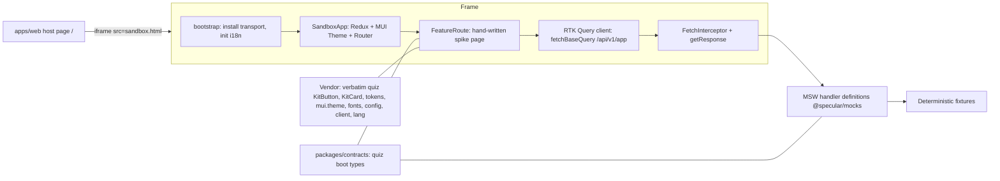

# 004: Sandbox runtime — plan

| Field | Value |
|---|---|
| Status | Draft (for review) |
| Phase | 0 (hard gate) |
| Date | 2026-09-12 |
| Gate | Product spec §9.1; 004 AC-1, AC-2, AC-4 |
| Trim source | Colorkrew/quiz @ `5a2d62ee6a9a67a03555bb5038c893836a363804` (2026-09-09) |

## 1. Goal and definition of done

Prove the Phase 0 hard gate:

- One hand-written page in the sandbox uses real `KitButton` and `KitCard`, the real theme (tokens + factory + fonts), and **exactly one** intercepted API call (`GET /api/v1/app/workspaces/overview`).
- It runs fully offline, in-browser, on React 19.2.4 + MUI 7.3.9 + Emotion 11.14.x, with **no hosted bundler service** (no WebContainers / Sandpack / StackBlitz; only the local Vite server).
- Playwright asserts inside the frame via `frameLocator` (AC-2), and the frame uses the injected fetch-interceptor transport fed by shared MSW handler definitions, with **no service worker inside the frame** (AC-4).
- The mock is the application itself: the iframe contains the target app runtime, not specular chrome; only the spike page is interactive.

Done when `bun run verify` passes from a clean checkout and the roadmap row `004-sandbox-runtime` flips to `mocked`.

## 2. Verified facts and documented deviations

| Claim (spec) | Checkout reality |
|---|---|
| React 19 | 19.2.4 ✓ |
| MUI 7 | `@mui/material` 7.3.9 (exact) ✓ |
| Emotion | `@emotion/react` 11.14.0, `@emotion/styled` 11.14.1 ✓ |
| `KitButton.tsx`, `KitCard.tsx` | `frontend/src/components/UIKit/` ✓ |
| `tokens.ts`, `mui.theme.ts` | `frontend/src/theme/` ✓ |
| RTK client seam | `frontend/src/services/api/internal_v2/client.ts` ✓ (`/api/v1/app`, `credentials: 'include'`, qs `arrayFormat: 'repeat'`) |
| `GET /workspaces/overview` | generated file: `WorkspaceOverview[]` ✓ |

Deviations we deliberately make (each recorded in `PROVENANCE.json`):

- Quiz Vite uses `babel-plugin-react-compiler`; we omit the React Compiler plugin (extra dep, behavior-sensitive).
- Quiz `store/index.ts` wires Sentry; trimmed out (no Sentry dep).
- Quiz `i18n.ts` wires zod locale error maps; trimmed out (no zod dep). Default language is overridable via `?lang=`; the sandbox pins `en` for deterministic assertions (quiz defaults to `ja`).
- Quiz shell (`@toolpad/core`, `@mui/x-date-pickers`, `luxon`, `AuthContextProvider`, `Toast`) is not trimmed; the Phase 0 shell is providers + route slot only.
- Spec §7.1 says "roughly 34 `Kit*` components"; the checkout has ~52 non-Figma UIKit `.tsx` files. Documentation-level mismatch only; the allowlist stays as specced.

## 3. Deliberately NOT in scope (Phase 0 is only the gate)

- Generation (001/002/003): no LLM, no envelopes, no dynamic TSX compilation/evaluation.
- The other two boot endpoints (`me/detail`, `workspaces`); only `/workspaces/overview` is handled now.
- The remaining allowlisted Kit components; only `KitButton` + `KitCard` are vendored (kit grows just-in-time).
- Full app shell: auth context, navigation, toasts, Sentry, toolpad, date pickers, dark mode.
- Opaque-origin isolation (`srcdoc`/`blob`/cross-origin frames); Phase 0 uses a same-origin iframe with the interceptor transport.
- Service-worker delivery **wired** into specular's own UI (module skeleton only; wiring lands with 001/009).
- Scenario triggers / failure axes for AC-2/AC-4-style tests; handoff (007); import (005); scaffold (006); enforcement (008); project home (009); `apps/server` (Phase 2); hosted demo; pixel-level fidelity guarantees.

## 4. Architecture



Decisions:

1. **Single app, two Vite entries**: `index.html` (specular host) and `sandbox.html` (target runtime). One `bun install`, one `vite dev`, one `vite build`; `vite preview` serves both statically.
2. **Transport even though same-origin**: the interceptor is installed inside the frame bundle. This is the exact mechanism Phase 1 needs if the frame becomes opaque-origin; proving it now removes the risk (no SW can register in such frames).
3. **No hosted bundler**: plain local Vite; the dynamic-TSX compilation question (esbuild-wasm/Sucrase) is Phase 1 and explicitly out of scope.
4. **The route is the feature mount seam**: `runtime/feature/FeatureRoute.tsx` is the element `RouterProvider` mounts; Phase 0 returns the spike page; Phase 1 replaces it with the generated feature.

## 5. Workspace layout (target)

```
specular-poc.initial/
├── package.json                  # private; workspaces: apps/*, packages/*, e2e
├── bun.lock                      # committed
├── tsconfig.base.json            # strict defaults shared by all packages
├── biome.json                    # lint/format (ignores vendor/)
├── .gitignore                    # node_modules, dist, playwright-report, test-results, *.local, .omo/
├── apps/web/                     # specular UI (React + Vite + TS + shadcn/ui) + sandbox host
│   ├── index.html                # host page (Phase 0 placeholder embedding the frame)
│   ├── sandbox.html              # target-app entry (second Vite input)
│   ├── vite.config.ts            # react plugin, @ alias, multi-entry
│   ├── scripts/sandbox-trim.ts   # sync + verify provenance against the quiz checkout
│   ├── public/mockServiceWorker.js  # generated by `bunx msw init` (SW skeleton)
│   └── src/
│       ├── main.tsx / App.tsx / index.css / lib/utils.ts / components.json
│       └── sandbox/
│           ├── main.tsx          # frame entry: install transport → init i18n → render
│           ├── runtime/
│           │   ├── bootstrap.ts  # installFetchInterceptorTransport(appHandlers) + lang
│           │   ├── SandboxApp.tsx# Provider(store) + ThemeProvider(createMuiTheme) + CssBaseline + Router
│           │   ├── feature/FeatureRoute.tsx     # route seam → WorkspaceOverviewSpike
│           │   ├── spikes/WorkspaceOverviewSpike.tsx
│           │   ├── services/api/internalApiV2.ts# adapted: one endpoint, types from contracts
│           │   ├── store/index.ts               # adapted: RTKQ only (no Sentry)
│           │   ├── i18n.ts                      # adapted: no zod; ?lang= override
│           │   ├── assets/lang/specular-spike/{en,ja}.json  # spike strings, merged
│           │   ├── PROVENANCE.json              # source map + hashes + quiz commit
│           │   └── vendor/                      # byte-identical, lint-excluded
│           │       ├── components/UIKit/{KitButton,KitCard}.tsx
│           │       ├── theme/{tokens.ts,mui.theme.ts,fonts/*.woff2}
│           │       ├── services/api/config.ts
│           │       ├── services/api/internal_v2/client.ts
│           │       └── assets/lang/{en,ja,ko,pt_BR}.json
├── packages/contracts/           # @specular/contracts (source-only, no build)
│   └── src/{index.ts,app-api.ts} # trimmed quiz types: Workspace, WorkspaceOverview, enum
├── packages/mocks/               # @specular/mocks (msw + @mswjs/interceptors)
│   └── src/{index.ts,fixtures/app.ts,handlers/app.ts,
│            transport/fetchInterceptor.ts,transport/browserWorker.ts,
│            __tests__/{handlers.test.ts,fetchInterceptor.test.ts}}
└── e2e/                          # @playwright/test
    ├── playwright.config.ts      # webServer: apps/web build + preview (port 4173)
    └── tests/{smoke.spec.ts,004-sandbox-spike.spec.ts}
```

## 6. Bun workspace setup

Root `package.json`:

```json
{
  "name": "specular",
  "private": true,
  "type": "module",
  "workspaces": ["apps/*", "packages/*", "e2e"],
  "scripts": {
    "dev": "bun --cwd apps/web run dev",
    "build": "bun --cwd apps/web run build",
    "typecheck": "bun --cwd packages/contracts run typecheck && bun --cwd packages/mocks run typecheck && bun --cwd apps/web run typecheck && bun --cwd e2e run typecheck",
    "test:unit": "bun --cwd packages/mocks run test",
    "test:e2e": "bun --cwd e2e run test",
    "lint": "biome check .",
    "sandbox:sync": "bun --cwd apps/web run sandbox:sync",
    "sandbox:verify": "bun --cwd apps/web run sandbox:verify",
    "verify": "bun run typecheck && bun run lint && bun run test:unit && bun run build && bun run sandbox:verify && bun run test:e2e"
  },
  "devDependencies": { "@biomejs/biome": "2.4.6" }
}
```

Version pins (exact; the target runtime must match quiz, specular UI shares the install):

| Package | Pin | Why |
|---|---|---|
| react, react-dom | 19.2.4 | spec + quiz |
| @mui/material | 7.3.9 | spec + quiz (exact) |
| @emotion/react, @emotion/styled | 11.14.0, 11.14.1 | quiz |
| @reduxjs/toolkit, react-redux | 2.11.2, 9.2.0 | quiz |
| i18next, react-i18next | 25.8.18, 16.5.8 | quiz |
| qs | 6.16.0 | quiz (`paramsSerializer`) |
| react-router | 7.18.2 | quiz route mount |
| vite, @vitejs/plugin-react, typescript | 7.3.6, 5.2.0, ~5.9.3 | quiz |
| msw, @mswjs/interceptors | 2.15.0, 0.42.5 | verified public `getResponse` + `FetchInterceptor` |
| vitest | 5.0.0 | node unit tests (supports Vite 7) |
| @playwright/test | 1.63.0 | acceptance harness |
| tailwindcss, @tailwindcss/vite | 4.3.3 | shadcn/ui baseline |

`packages/*` are source-only: `"exports": { ".": "./src/index.ts" }`, `@specular/*` deps declared as `workspace:*`. `apps/web` resolves them via Bun symlinks; Vite transpiles the TS sources.

## 7. Trimmed runtime: assembly and honesty to real sources

**Provenance policy**

- Every vendored file is either **verbatim** (byte-identical) or **adapted** (documented diff).
- `runtime/PROVENANCE.json` records for each file: `path`, `source` (quiz path), `mode`, `sha256` (verbatim only), `notes` (adapted only), and the quiz commit `5a2d62ee…`.
- `apps/web/scripts/sandbox-trim.ts`:
  - `sandbox:sync` — copies verbatim files from `$QUIZ_CHECKOUT` (default `/Users/andrei.damian/workspace/github.com/Colorkrew/quiz`), verifies every adapted source still exists, regenerates `PROVENANCE.json`.
  - `sandbox:verify` — recomputes sha256 of verbatim files against the manifest and fails on drift; part of `bun run verify`.
- Verbatim files are preserved under `runtime/vendor/` with **original relative structure** so the quiz's own relative imports (`./fonts/Inter.woff2`, `../config`) remain untouched. `vendor/**` is excluded from biome.
- Adapted files start with a header comment: `// specular trim: adapted from frontend/src/... @ 5a2d62e — <what changed>`.

**Trim inventory**

| Target (`apps/web/src/sandbox/runtime/…`) | Quiz source (`frontend/src/…`) | Mode |
|---|---|---|
| `vendor/components/UIKit/KitButton.tsx` | `components/UIKit/KitButton.tsx` | verbatim |
| `vendor/components/UIKit/KitCard.tsx` | `components/UIKit/KitCard.tsx` | verbatim |
| `vendor/theme/tokens.ts` | `theme/tokens.ts` | verbatim |
| `vendor/theme/mui.theme.ts` + `vendor/theme/fonts/*.woff2` | `theme/mui.theme.ts` + `theme/fonts/` | verbatim |
| `vendor/services/api/config.ts` | `services/api/config.ts` | verbatim |
| `vendor/services/api/internal_v2/client.ts` | `services/api/internal_v2/client.ts` | verbatim |
| `vendor/assets/lang/{en,ja,ko,pt_BR}.json` | `assets/lang/*.json` | verbatim |
| `services/api/internalApiV2.ts` | `services/api/internal_v2/internalApiV2.ts` | adapted — only `getWorkspacesOverview` + response alias; types imported from `@specular/contracts`; no `enhanceEndpoints` barrel |
| `store/index.ts` | `store/index.ts` | adapted — drop Sentry enhancer + toast reducer; keep `internalApiV2` reducer/middleware, `RootState`, `AppDispatch` |
| `i18n.ts` | `i18n.ts` | adapted — drop zod; `?lang=` override; local lang union replaces `SupportedLangEnum` import; merge `specular-spike` resources |
| `SandboxApp.tsx`, `bootstrap.ts`, `feature/FeatureRoute.tsx`, `spikes/WorkspaceOverviewSpike.tsx`, `assets/lang/specular-spike/*` | — | new, specular-authored |

Services intentionally skipped: `internal_v2/index.ts` (`enhanceEndpoints`), `multipartFormData.ts`, `sentry.tsx`, `contexts/`, `pages/`, `Router.tsx`, `Routes.ts` (shell pieces not needed by the gate).

## 8. Transport adapter, handlers, and the endpoint contract

**Handler definitions** (real MSW definitions; same array later feeds `setupWorker`/`setupServer`/`@msw/cloudflare` unchanged):

```ts
// packages/mocks/src/handlers/app.ts
import { http, HttpResponse } from 'msw'
import { workspacesOverview } from '../fixtures/app'

export const appHandlers = [
  http.get('/api/v1/app/workspaces/overview', () =>
    HttpResponse.json(workspacesOverview),
  ),
]
```

**Sandbox transport** (the one adapter; delivery mechanism per spike):

```ts
// packages/mocks/src/transport/fetchInterceptor.ts
import { FetchInterceptor } from '@mswjs/interceptors/fetch'
import { getResponse, type RequestHandler } from 'msw'

export function installFetchInterceptorTransport(
  handlers: Array<RequestHandler>,
): () => void {
  const interceptor = new FetchInterceptor()
  interceptor.on('request', async ({ request, controller }) => {
    const response = await getResponse(handlers, request)
    if (response) controller.respondWith(response)
    // unmatched requests are left to the network: offline they fail loudly, never silently pass
  })
  interceptor.apply()
  return () => interceptor.dispose()
}
```

- Installed in `bootstrap.ts` **before the first render**, so the page's initial query cannot escape.
- API verified against msw 2.15.0 / interceptors 0.42.5: async listener, `controller.respondWith`, `apply()`/`dispose()`. The listener must remain `async` (the docs snippet sometimes omits it).
- Fallback if this API regresses: ~20-line `globalThis.fetch` wrapper calling `getResponse` (same handlers), documented in §12.

**Same-origin delivery skeleton** (specular's own UI; Phase 1 wires it): `transport/browserWorker.ts` exports `setupWorker(...appHandlers)` from `msw/browser` and `startBrowserWorker()`; `bunx msw init apps/web/public --save` generates `mockServiceWorker.js`. Not started by any Phase 0 entry point.

**Endpoint contract (finalized here)**

- `GET /api/v1/app/workspaces/overview` → `200`, `Content-Type: application/json`, body `WorkspaceOverview[]`.
- Types come verbatim from `packages/contracts/src/app-api.ts` (copied from the quiz generated file lines 1654–1678): `WorkspaceVisibilityEnum`, `Workspace`, `WorkspaceOverview`.
- Fixture (deterministic; one source for unit tests, dev, demo, e2e):
  `Acme` (2 members, private, owner) and `Design Team` (5 members, public, member); fixed ids (`wsp_000…001`, `wsp_000…002`) and fixed `createdAt`/`updatedAt` (`2026-01-01T00:00:00.000Z`); no `Date.now`, no randomness.
- Swap seam: in Phase 2 the handler set is replaced by the real backend behind the same contract; the runtime itself is not swapped (004 spec).

## 9. Spike page and route mount

- `sandbox.html` → `src/sandbox/main.tsx` → `bootstrap.ts` installs the transport via `installFetchInterceptorTransport(appHandlers)`, awaits `i18n.changeLanguage(params.get('lang') ?? 'en')`, then renders `SandboxApp`.
- `SandboxApp`: `<Provider store={store}>` → `<ThemeProvider theme={createMuiTheme()}>` → `<CssBaseline/>` → `<RouterProvider router={createBrowserRouter([{ path: '*', element: <FeatureRoute/> }])}/>`. No specular chrome: the frame contains only the target application.
- `FeatureRoute` returns `WorkspaceOverviewSpike` (Phase 1 replaces this file's body with the generated feature).
- `WorkspaceOverviewSpike`: `useGetWorkspacesOverviewQuery()` from the trimmed client; renders one `KitCard` per workspace (name + `t('spike.members', { n })`) and one `KitButton` (`t('spike.refresh')`, `onClick={() => refetch()}`, `disabled={isFetching}`). Styling through `sx` + theme tokens only; user-facing strings through `t()` (the same rules generation will be held to). Test hooks: `data-testid="spike-card"`, `data-testid="spike-refresh"` (Kit components spread unknown props onto MUI `Card`/`Button`).
- Spike strings live in `assets/lang/specular-spike/{en,ja}.json` merged under the `spike` namespace at i18n init, so the copied quiz locale files stay verbatim.

## 10. Playwright gate

- `e2e/playwright.config.ts`: chromium only; `baseURL: http://localhost:4173`; `webServer` runs `bun --cwd ../apps/web run build && bun --cwd ../apps/web run preview --port 4173 --strictPort` (production build = no StrictMode double-effects, hashed static assets, no proxy, no server).
- `004-sandbox-spike.spec.ts` asserts, from `page.frameLocator('[data-testid="sandbox-frame"]')`:
  1. **Real kit + fixture**: a `spike-card` containing `Acme` and `2 members` is visible (data exists only in the mock fixture; preview serves no API, so a non-intercepted call would 404 and fail this).
  2. **Interaction drives a second intercepted call**: `page.waitForRequest(r => r.url().includes('/api/v1/app/workspaces/overview'))`, then click `spike-refresh`; wait resolves.
  3. **Real theme**: `spike-refresh` has `background-color: rgb(2, 118, 241)` (tokens `primary.300 = #0276F1`) and the page font-family includes `Noto Sans JP` (fonts served locally).
  4. **Framed assertion**: all of the above happen through `frameLocator` (AC-2).
  5. **No service worker in the frame** (AC-4): evaluate `navigator.serviceWorker?.controller === null` in the sandbox frame.
  6. **Fully offline**: every request observed on the page starts with the local origin; assert zero external URLs (AC-1).

## 11. Verification and TDD approach

- **Unit (packages/mocks, Vitest node):** written first, then implemented.
  - `handlers.test.ts` — `getResponse(appHandlers, new Request('http://localhost/api/v1/app/workspaces/overview'))` returns `200` JSON deep-equal to the fixture; the fixture compiles against `WorkspaceOverview[]` (`satisfies`).
  - `fetchInterceptor.test.ts` — `installFetchInterceptorTransport(appHandlers)`; `await fetch('http://localhost/api/v1/app/workspaces/overview')` resolves from handlers; `dispose()` restores.
- **Acceptance (e2e, Playwright, real browser + iframe):** the gate spec §10 is written first against the preview server and watched fail for the right reason; then T011/T012 make it pass. This is the page-level TDD layer; no jsdom/Testing-Library is added in Phase 0 (RTK Query's relative `baseUrl` does not resolve in Node's `Request`; browser-mode Vitest is a Phase 1 option — noted, not needed).
- **Static:** `tsc --noEmit` per package; `biome check .`; `sandbox:verify` (provenance hashes).
- **Commands (all offline after one-time installs):**

```bash
bun install
bun run typecheck && bun run lint && bun run test:unit
bun run build && bun run sandbox:verify
bun run test:e2e
bun run dev        # manual demo: open http://localhost:5173, frame shows the app
```

- **Gate evidence:** clean-checkout `bun run verify` output + e2e report committed to the PR description; roadmap flip only after that.

## 12. Risks and fallbacks

| Risk | Mitigation / fallback |
|---|---|
| Quiz checkout drifts from spec assumptions | Assumptions re-verified here (all match). Pin exact versions; `PROVENANCE.json` records commit `5a2d62e`; `sandbox:verify` fails on drift, forcing a conscious re-trim. |
| `@mswjs/interceptors` API churn (0.x) | Pin 0.42.5; API captured in one ~15-line module. Fallback: monkey-patch `globalThis.fetch` and call `getResponse` (same handlers). |
| MSW v3 migration later | Pin msw 2.15.0; upgrade isolated to `packages/mocks` (handlers + `getResponse` are the exposed surface). |
| Vite multi-entry / iframe quirks (e.g. `sandbox.html` not emitted) | Explicit `build.rollupOptions.input { main, sandbox }`; verify `dist/sandbox.html` exists in `build`. Fallback: second local Vite server for `sandbox.html` (cross-origin frame still tests the interceptor, even more faithfully). |
| Fonts (2.4 MB woff2) asset handling | Standard Vite asset imports; `vite/client` types included. Fallback: drop `MuiCssBaseline` font-face, use the fallback stack; tokens (the graded part) unaffected. |
| `react-router` v7 import mode (`react-router` vs `react-router-dom`) | Use `react-router@7.18.2` exactly as the quiz does (`RouterProvider`). Fallback: render `FeatureRoute` directly; the gate does not depend on routing. |
| shadcn/Tailwind init under Bun/monorepo | Minimal hand-writable baseline (index.css `@import "tailwindcss"`, `@/` alias, `cn`, `components.json`); no shadcn component is used by the gate. |
| Playwright browsers need a one-time download | Document `bunx playwright install chromium` as an environment prerequisite; afterward the suite runs offline. |
| Iframe same-origin ≠ fully "sandboxed" | Accepted for Phase 0 (spec AC-4 proves the interceptor path inside a frame); opaque-origin `srcdoc`/`blob` isolation is explicit Phase 1 work. |
| React StrictMode double effects in dev | E2E runs the production preview build; dev-only noise documented. |
| Quiz `client.ts` `tagTypes` vs generated endpoints mismatch (`me`, `user-preferences` tags) | We only vendor the endpoint whose tag (`workspace-list`) exists; do not extend tags without aligning. Flagged as observed upstream inconsistency. |
| Vendored quiz sources licensing/ownership | Private demo repo; `PROVENANCE.json` records origin, commit, and what changed (honesty note per §7.1). |

## 13. Commit strategy (atomic; each commit green for typecheck + its tests)

1. `docs(004): add sandbox runtime plan and tasks`
2. `chore: scaffold bun workspaces (root config, tsconfig, biome, gitignore)` — T001
3. `feat(contracts): add trimmed quiz app API types` — T002
4. `feat(web): scaffold React + Vite app hosting the sandbox iframe` — T004
5. `test(e2e): scaffold Playwright harness` — T005
6. `feat(mocks): add MSW handlers, fixtures, and transport adapter` — T003, T006–T008
7. `feat(sandbox): vendor trimmed quiz runtime with provenance` — T009, T010
8. `feat(sandbox): mount hand-written spike page at the app route` — T011, T012
9. `test(e2e): add the 004 sandbox gate (frameLocator + offline)` — T013
10. `docs(004): record Phase 0 gate evidence and flip roadmap to mocked` — T017

Rule: never commit red. `sandbox:verify` joins `bun run verify` at commit 7; e2e joins at commit 9. Uncommitted doc edits already present in the tree (`specular.md`, `005`/`006` specs) are left untouched and unstaged.

## 14. Phase 1 hooks this establishes

- `FeatureRoute.tsx` is the generated-feature mount point (002).
- `appHandlers` grows to the full boot set + feature endpoints; scenario headers/triggers slot into the same definitions (001/003/009).
- `browserWorker.ts` gets wired into specular's own app for D-14 same-origin mocking.
- Provenance tooling keeps the runtime honest as more Kit components are vendored (008's allowlist).
- Dynamic in-browser TSX evaluation (esbuild-wasm) and opaque-origin frame isolation are the two deliberate Phase 1 follow-ups.
